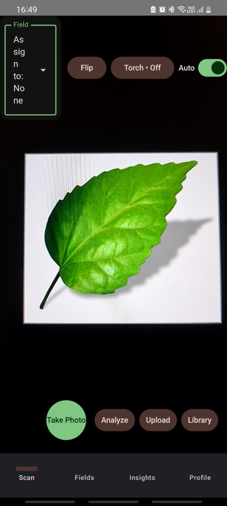
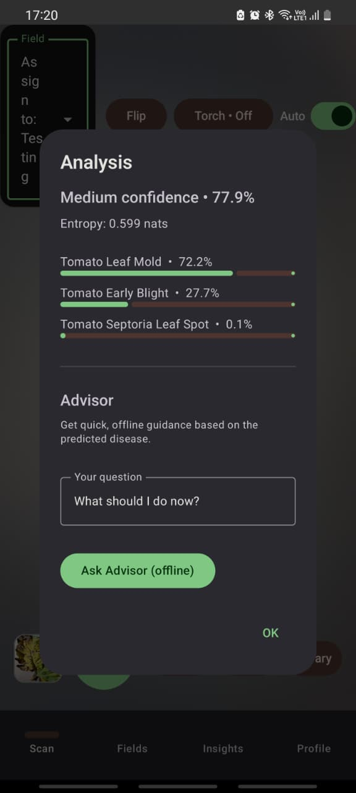
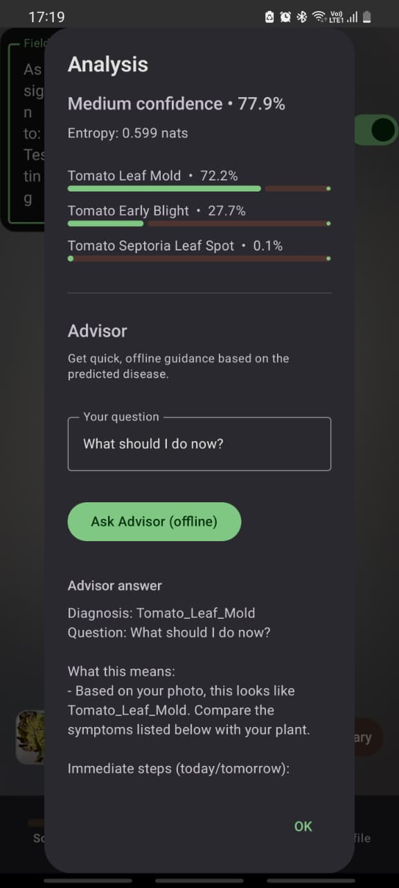
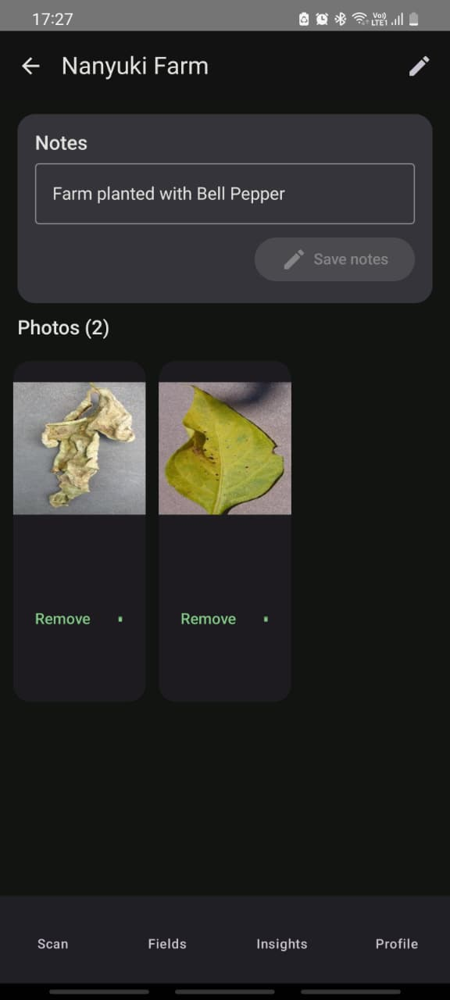
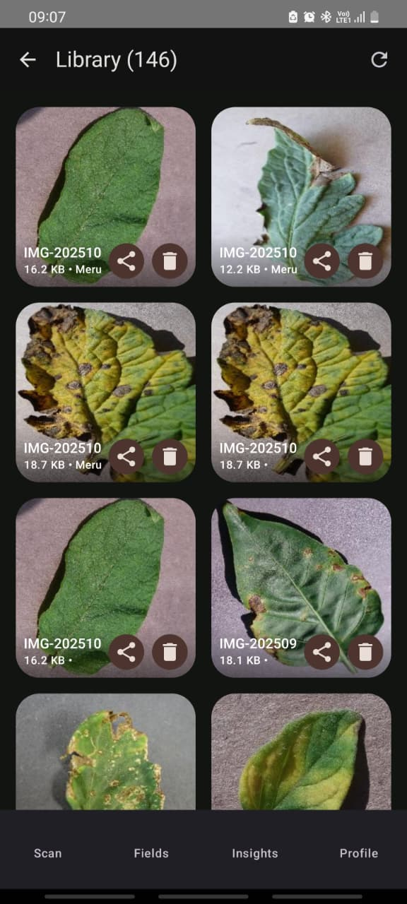

# AgriScan 🌿📱

**An offline-first Android application for detecting tomato, potato, and bell pepper leaf diseases using on-device deep learning and an offline advisory knowledge base.**

[]()
[]()
[]()
[]()
[]()

---

## Overview

**AgriScan** is an Android mobile application that helps farmers and agricultural extension users identify crop leaf diseases offline using an on-device **TensorFlow Lite** image classification model.

The app focuses on three common crops:

- Tomato
- Potato
- Bell pepper

After a user captures or selects a leaf image, AgriScan runs local inference on the device and returns the top disease predictions with confidence scores. It also provides offline advisory guidance using a lightweight Retrieval-Augmented Generation-style knowledge base stored locally in `kb.jsonl`.

AgriScan is designed for low-connectivity agricultural environments where farmers may not always have reliable internet access.

---

## Why AgriScan Matters

Plant diseases can reduce crop yield, increase production costs, and affect food security. Many smallholder farmers may struggle to access timely expert diagnosis, especially in rural or low-connectivity areas.

AgriScan aims to support early disease awareness by providing:

- Fast on-device disease prediction
- Offline access to disease guidance
- Field-based observation history
- Farmer-friendly recommendations
- A privacy-preserving local-first design

This project is currently an early-stage open-source prototype and is being improved toward a more reliable, contributor-friendly agricultural decision-support tool.

---

## Key Features

- **Offline disease detection** using TensorFlow Lite.
- **On-device inference** with no server required for prediction.
- **Top-3 predictions** with confidence scores.
- **Offline Knowledge Assistant** powered by a local `kb.jsonl` knowledge base.
- **Disease guidance** including symptoms, causes, spread, and recommended actions.
- **Capture → Diagnose → Explain → Save** workflow.
- **Field/plot organization** for tracking observations.
- **Local-first storage** using Room database.
- **Image storage** in the app’s internal storage.
- **Modern Android UI** built with Kotlin and Jetpack Compose.
- **Privacy-conscious design** because images and diagnosis records remain on the device unless the user chooses otherwise.

---

## App Screens

### Capture

Take or select a crop leaf photo.



### Diagnosis

View top predictions, confidence scores, and quick next actions.



### Knowledge Assistant

Access offline disease guidance linked to the predicted disease.



### Fields

Organize observations by farm field or plot.



### Library

View saved images, predictions, and diagnosis history.



---

## Technology Stack

| Layer | Technology |
|---|---|
| Language | Kotlin |
| UI | Jetpack Compose, Material 3 |
| Navigation | Navigation Compose |
| Machine Learning | TensorFlow Lite |
| Model Architecture | MobileNetV2 transfer learning |
| Local Database | Room |
| Image Loading | Coil |
| Knowledge Base | JSON Lines file: `kb.jsonl` |
| Platform | Android |
| Development Environment | Android Studio |

---

## Architecture

AgriScan follows a local-first mobile architecture.

```text
User Image
   ↓
Image Preprocessing
   ↓
TensorFlow Lite Inference
   ↓
Top-3 Disease Predictions
   ↓
Offline Knowledge Base Lookup
   ↓
Farmer-Friendly Guidance
   ↓
Save Observation to Room Database
   ↓
View History in Library / Fields
```

### Main Components

| Component | Responsibility |
|---|---|
| Compose UI | Displays capture, diagnosis, knowledge, fields, and library screens |
| TFLite Classifier | Loads the `.tflite` model and performs image inference |
| KB Loader | Loads disease guidance from `kb.jsonl` |
| Room Database | Stores observations, fields, prediction metadata, and image paths |
| Internal Storage | Stores captured or selected image files |
| Navigation Layer | Manages app screen transitions |

---

## Model and Dataset

### Model

The current model is based on **MobileNetV2** using transfer learning.

Training approach:

- Base model: MobileNetV2 with ImageNet weights
- Classification head: Global Average Pooling → Dropout → Dense Softmax
- Warm-up training with frozen base layers
- Fine-tuning with selected layers unfrozen
- Exported to TensorFlow Lite for Android deployment

### Training Configuration

| Stage | Configuration |
|---|---|
| Warm-up | Adam optimizer, learning rate `3e-4`, 8 epochs |
| Fine-tuning | Adam optimizer, learning rate `1e-5`, 10 epochs |
| Quantization | Dynamic range and full INT8 experiments |
| Deployment format | TensorFlow Lite |

### Dataset

The model was trained using a curated subset of the PlantVillage dataset.

Supported classes include:

#### Tomato

- Bacterial spot
- Early blight
- Late blight
- Leaf mold
- Septoria leaf spot
- Target spot
- Tomato mosaic virus
- Tomato yellow leaf curl virus
- Two-spotted spider mite
- Healthy

#### Potato

- Early blight
- Late blight
- Healthy

#### Bell Pepper

- Bacterial spot
- Healthy

---

## Model Results

| Metric | Score |
|---|---|
| Validation accuracy | ~93.73% |
| Held-out test accuracy | ~93.45% |

The model exports include:

```text
model_fp32.tflite
model_dr.tflite
model_int8.tflite
labels.txt
```

The Android app currently uses:

```text
model_int8.tflite
```

> **Note:** Model performance may vary in real-world field conditions due to lighting, background noise, image blur, crop variety, and disease stage. AgriScan should be used as an advisory support tool, not as a replacement for professional agricultural diagnosis.

---

## Offline Knowledge Base

AgriScan includes an offline knowledge base stored as a JSON Lines file:

```text
app/src/main/assets/kb.jsonl
```

Each line represents one disease guidance record.

Example:

```json
{"id":"tomato_late_blight","title":"Tomato — Late Blight","symptoms":["water-soaked lesions","white mold on leaf undersides"],"advice":["Remove infected leaves","Avoid overhead irrigation","Use recommended fungicide where appropriate"],"notes":"Late blight spreads rapidly in cool, wet conditions and can destroy crops if not managed early."}
```

The knowledge assistant uses this local file to provide disease-specific guidance without requiring internet access.

---

## Project Structure

```bash
AgriScanDetection/
├─ app/
│  ├─ src/
│  │  └─ main/
│  │     ├─ java/com/example/agriscan/
│  │     │  ├─ data/
│  │     │  │  └─ db/
│  │     │  │     ├─ entities/
│  │     │  │     ├─ dao/
│  │     │  │     └─ AgriScanDatabase.kt
│  │     │  ├─ ml/
│  │     │  │  └─ TFLiteClassifier.kt
│  │     │  ├─ rag/
│  │     │  │  └─ KBLoader.kt
│  │     │  ├─ ui/
│  │     │  │  ├─ capture/
│  │     │  │  ├─ diagnosis/
│  │     │  │  ├─ fields/
│  │     │  │  ├─ knowledge/
│  │     │  │  └─ library/
│  │     │  └─ MainActivity.kt
│  │     ├─ assets/
│  │     │  ├─ model_int8.tflite
│  │     │  ├─ labels.txt
│  │     │  └─ kb.jsonl
│  │     └─ AndroidManifest.xml
│  └─ build.gradle.kts
├─ docs/
│  └─ screens/
│     ├─ capture.jpeg
│     ├─ diagnosis.jpeg
│     ├─ knowledge.jpeg
│     ├─ fields.jpeg
│     └─ library.jpeg
├─ README.md
└─ LICENSE
```

---

## Getting Started

### Prerequisites

Install the following:

- Android Studio
- JDK 17
- Android SDK Platform 34 or later
- Gradle/Android Gradle Plugin compatible with the project
- A physical Android device or emulator

Recommended:

- Physical Android device for camera testing
- Minimum SDK 26 or later

---

## Clone the Repository

```bash
git clone https://github.com/is-project-4th-year/AgriScanDetection.git
cd AgriScanDetection
```

---

## Required Assets

Place the following files in:

```text
app/src/main/assets/
```

Required files:

```text
model_int8.tflite
labels.txt
kb.jsonl
```

### Asset Descriptions

| File | Purpose |
|---|---|
| `model_int8.tflite` | Quantized TensorFlow Lite model used for on-device inference |
| `labels.txt` | Class labels in the exact order used during model training |
| `kb.jsonl` | Offline disease guidance knowledge base |

---

## Build and Run

1. Open the project in Android Studio.
2. Let Gradle sync successfully.
3. Confirm the required assets exist in `app/src/main/assets/`.
4. Connect a physical Android device or start an emulator.
5. Click **Run**.

---

## Main Dependencies

```kotlin
// Compose
implementation(platform("androidx.compose:compose-bom:2024.10.01"))
implementation("androidx.compose.ui:ui")
implementation("androidx.compose.material3:material3")
implementation("androidx.navigation:navigation-compose:2.8.0")

// Image loading
implementation("io.coil-kt:coil-compose:2.6.0")

// Room
implementation("androidx.room:room-runtime:2.6.1")
kapt("androidx.room:room-compiler:2.6.1")
implementation("androidx.room:room-ktx:2.6.1")

// TensorFlow Lite
implementation("org.tensorflow:tensorflow-lite:2.14.0")
implementation("org.tensorflow:tensorflow-lite-support:0.4.4")
```

---

## Room Database

Database name:

```text
agriscan.db
```

Runtime location:

```text
/data/data/com.example.agriscan/databases/agriscan.db
```

Example entities:

```text
Observation(
    id,
    imagePath,
    crop,
    top1Label,
    top1Confidence,
    top3Json,
    adviceIds,
    fieldId,
    notes,
    createdAt,
    latitude,
    longitude
)

Field(
    id,
    name,
    crop,
    location,
    notes,
    createdAt
)
```

Images are saved in the app’s internal files directory. The Room database stores metadata and file paths rather than image blobs.

---

## Security and Privacy

AgriScan is designed with a local-first approach.

Current privacy/security principles:

- Crop images remain on the device.
- Disease predictions are generated locally.
- Observation history is stored locally using Room.
- No internet connection is required for diagnosis.
- The app avoids unnecessary transmission of user data.

Security areas planned for improvement:

- Dependency vulnerability scanning
- Safer file handling
- Model file integrity checks
- Permission minimization
- Improved input validation
- Clear data deletion controls
- Secure backup/export options

---

## Ethical Use Disclaimer

AgriScan provides advisory support only. It should not be treated as a final agricultural diagnosis.

Users should consult qualified agricultural officers, extension workers, or plant pathologists for serious crop disease outbreaks or uncertain cases.

The model may produce incorrect predictions when images are blurry, poorly lit, incomplete, or taken under unfamiliar field conditions.

---

## Troubleshooting

### App cannot find the model

Check that the model is placed here:

```text
app/src/main/assets/model_int8.tflite
```

Also confirm that the filename used in code matches the filename in the assets folder.

### Predictions look incorrect

Check the following:

- The image is clear and focused.
- The leaf fills most of the frame.
- Lighting is natural and not too dark.
- The `labels.txt` order matches the model training class order.
- The preprocessing in Android matches the preprocessing used during training.

### Knowledge guidance does not appear

Check that:

```text
app/src/main/assets/kb.jsonl
```

exists and uses valid JSON Lines format.

Each disease record should have a stable `id` and `title`.

### Screenshots do not show in README

Confirm that the images exist at:

```text
docs/screens/
```

and that the file extensions match the README paths, for example:

```text
capture.jpeg
diagnosis.jpeg
knowledge.jpeg
fields.jpeg
library.jpeg
```

---

## Roadmap

Planned improvements:

- Add model integrity verification.
- Add automated Android unit and instrumentation tests.
- Add GitHub Actions for build checks.
- Add dependency scanning.
- Add Grad-CAM-style visual explanations.
- Improve the offline knowledge assistant.
- Add more crops and disease classes.
- Add Kiswahili and local-language support.
- Add low-literacy farmer-friendly UX modes.
- Add per-field trend analytics.
- Add exportable diagnosis reports.
- Add contributor documentation.
- Add issue templates and pull request templates.
- Add release versioning.

---

## Contributing

Contributions are welcome.

Useful contribution areas include:

- Android UI improvements
- TFLite inference optimization
- Model evaluation
- Offline knowledge base expansion
- Agricultural disease content review
- Testing and bug fixing
- Documentation
- Security review
- Localization

Suggested workflow:

1. Fork the repository.
2. Create a new branch.

```bash
git checkout -b feature/your-feature-name
```

3. Make your changes.
4. Test the app.
5. Commit your changes.

```bash
git commit -m "Add your clear commit message"
```

6. Push your branch.

```bash
git push origin feature/your-feature-name
```

7. Open a pull request.

---

## Maintainer

Primary maintainer:

**Emmanuel Mugambi Riungu**

Responsibilities include:

- Maintaining the Android application
- Improving the TensorFlow Lite inference pipeline
- Updating the offline disease knowledge base
- Reviewing issues and pull requests
- Preparing releases and documentation
- Improving project security and reliability

---

## Acknowledgements

This project acknowledges:

- PlantVillage dataset for crop disease image data
- TensorFlow Lite for mobile machine learning deployment
- MobileNetV2 for efficient image classification
- Android Jetpack libraries
- Kotlin and Jetpack Compose
- Room database
- The open-source Android and machine learning communities

---

## License

This project is licensed under the MIT License.

See the `LICENSE` file for details.
